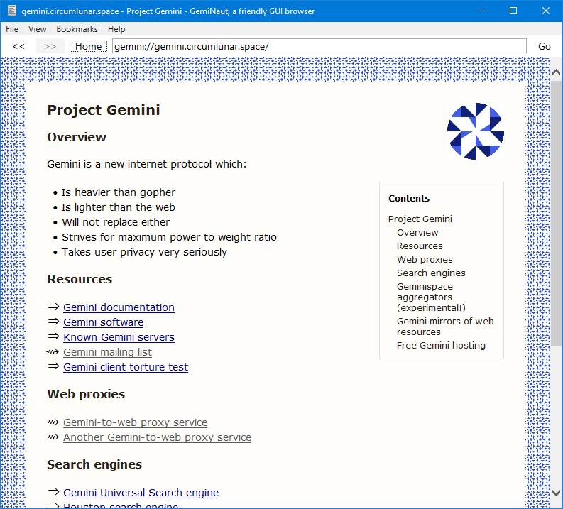
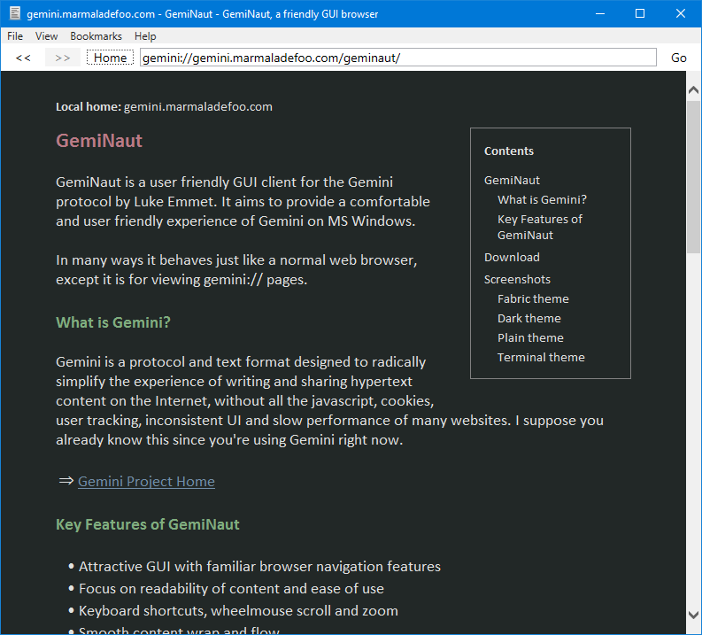

# GemiNaut

A user friendly client to browse Gemini (and Gopher) from Windows.

Gemini is a radically simple protocol and text format for browsing on the Internet.
For more information see <a href="https://gemini.circumlunar.space/">https://gemini.circumlunar.space/</a>

# Download

You can download a pre-built application for Windows from the <a href="https://www.marmaladefoo.com/pages/geminaut">GemiNaut home page</a>

# Key features

* Familiar navigation actions, smooth scrolling and text wrap
* Keyboard shortcuts, wheelmouse zoom
* Fast navigation through history, including remembering scroll offset
* Support bullet, heading and quote line styles
* View linked images or download linked files
* Flexible theming engine
* Site based themes
* Visually distinguish internal (gopher, gemini) vs external links (http, https etc)
* Table of contents (Fabric and Dark themes)
* Icon hints to common non textual content (images, audio, video, docs) 
* Support both Gemini and Gopher protocol
* Autolinking of urls in Gopher text pages
* View source

# License 

GPL 3

# Screenshots

Fabric theme (site specific themes):

Dark theme:

# History

## 0.8.7, 8-aug-2020

0.8.7

* only show tooltip on preformatted text if non-empty
* drop use of proxy for gopher and allow file downloading
* display images directly from gopher
* use maintained gopher client gopher-get published to https://github.com/LukeEmmet/gopher-get
* resource download possible from cgi script as well as static files
* improve link wrap in gopher using monospace fonts in fabric themes
* file->new to start a new GemiNaut instance with the current URL to fork the browsing session
* can start with a URL commandline parameter
* use same identity in classic fabric theme for /~foo as users/foo
* navigated or redirected URIs are now normalised (e.g. remove port if it is the default for the scheme)
* binary files can now be downloaded to chosen location, not open in proxy (gemini)
* can specify download max size/time before abandoning
* new settings window for download options and home url
* when upgrading from previous version, keep previous settings
* hanging indents for bullets and links in terminal theme
* keyboard shortcuts for bookmarks (e.g. Alt+B) and other menus
* build links correctly when a port is given within the URL
* server size and timeout for slow or too large content
* simple image display within GemiNaut
* updated build of gemget

## 0.8.6, 6-Jul-2020

GemiNaut 💓 Gopher

* GemiNaut is now a gopher client as well as gemini
* preformatted areas now have their own scroll bar and don't overflow the side of the content
* update Fabric theme so it uses internally generated fabric and identicon (previous Fabric theme still available as "classic")
* automatic linking of plain urls in gopher text files
* automatic generation of page titles for gopher pages based on url
* update to use latest gemget 1.3.0
* theming engine will use same theme for the same user on gemini and gopher
* gopher text is monospaced but will softwrap for longer lines > 85 chars
* only display text/gemini as gemini content, otherwise use plain text preformatted rendering
* make bookmarks window wider
* show tooltips or urls for bookmark entries
* better feedback messages if content cannot be displayed
* check url entered into address bar is valid syntax before trying to navigate to it
* support spacers in bookmarks list with lines of hyphens or underscores longer than two characters
* minor improvements to themes
* use a smaller border around placemarker icon when there is no TOC

## 0.8.5, 19-Jun-2020

* new dark theme, with variable width font, colours are based on dark themes of source code editors 
* bookmarks - source format is just text/gemini
* better vertical spacing - e.g. headings always have space between them and surrounding paragraphs
* user definable themes - create your own and drop it in the GmiConverters/themes folder
* help files now use text/gemini format and have their own table of contents
* minor style improvements for plain theme

## 0.8.4, 10-Jun-2020

* use correct percent encoding for URL requests with input
* links with encoded query expression now passed on to server correctly
* support quotation line style (new addition to Gemini spec)
* show an icon on links to probable images (png, jpg etc) as a visual hint
* asterisks must be followed by space to become a bullet (Gemini spec update)
* remove debug white border around navigation in Fabric theme
* minor style updates
* bug fix: don't remove commas and separators from text lines

## 0.8.3, 29-May-2020

* add automatic page level table of contents for Fabric theme

## 0.8.2, 28-May-2020

* fix keyboard focus problem so you dont have to click into browser on each page
* display view->source GMI as utf-8

## 0.8.1, 27-May-2020

First public release

* added simple userguide
* infer the document title from the first heading or para text line and show in window caption
* darken the background a tiny bit in Fabric theme to be less saturated
* workaround for GemGet bug which overwrites into the output file, rather than replacing the whole file
* user selectable themes (4 to start with Fabric, Plain, Terminal and Unified UI)
* html escape source content before display
* pass torture tests relating to link formation 
* detect response redirect urls and adjust links accordingly
  (e.g. gemini://domain/users/user -> gemini://domain/users/user/)
* pad output with blank lines at end for better display of short content
* new plain line blocks always preceded by at least one blank line
* prettify spacing of headings, always have a blank line before these.
* prettify spacing of links/bullets, always have a blank line unless previous element was one too
   (e.g. gemini://gemini.circumlunar.space:1965/users/acdw/ is laid out more pleasantly)
* when loading raw gmi for view source get browser to interpret as text/plain 
* application icon from http://www.iconarchive.com/show/pretty-office-8-icons-by-custom-icon-design/Text-align-left-icon.html
* txtUrl follows page better
* local versions of Rebol and GmiConverters and Gemget folders used if found
* more pretty handling of page not found (status 51)
* txtUrl never shows https urls
* user can edit home page
* show prompt for query building
* decorate links to expected binary files with document glyph to hint content
* hanging indent on bullets and links
* visual hinting of non gemini links with glyph and link style
* show tooltip of url to be navigated to
* code fences for preformatted areas, including label as tooltip
* toast popups for error conditions
* session and server independent identikons and page background texture
* user based visual identity/theme for personal sub-sites, not requiring author control
* view source
* launch external urls in system browser
* use http proxy for common binary file types
* empty cache on close
* prettify links, headings and bullets

# Intrinsic features in virture of using a web browser

* go back and forward remembers scroll offset
* rich CSS styling and visual design
* smooth scrolling
* tab through page links
* cursor keys, page/up down, keyboard shortcuts for back/forwards
* zoom with wheelmouse
* navigate forwards, back, quickly (browser cache)
* wrap long lines to window
* Ctrl+F to find in current page
* Select all, copy to clipboard
* Ctrl+P to print page

